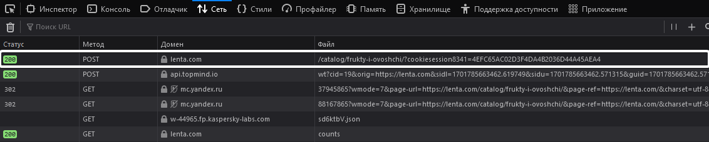
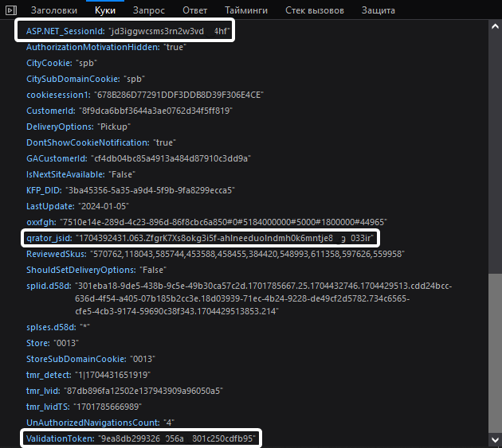
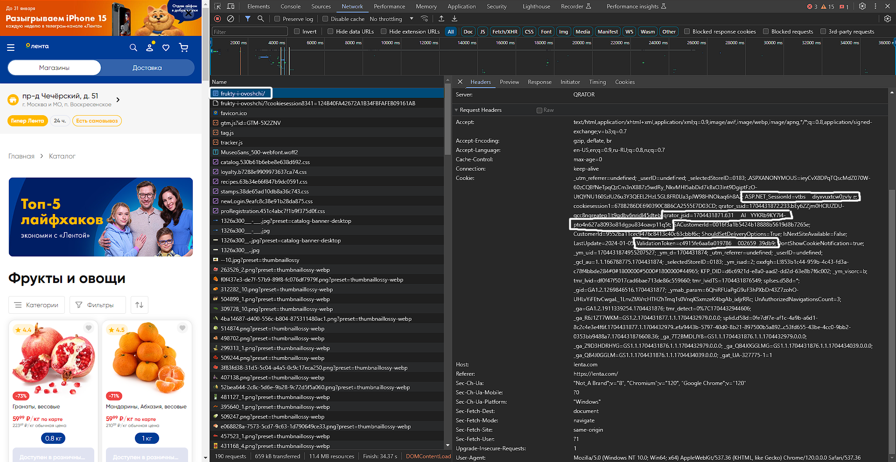

# How to download
Click `<> Code` button and then click `Download ZIP`. when it downloads, unzip it.

# How to use
## Setting cookies
- Open [this link](https://lenta.com/catalog/frukty-i-ovoshchi/)
- Right click anywhere and then click `Inspect` _("Исследовать" для Firefox; "Просмотреть код" для Chrome)_
- Click `Network` _(Сеть)_ and reload page 
- Go to `request_data.json` file in program directory and paste there your cookie values. 
_The file can be opened with standard notebook_ 

_See below for instructions on obtaining cookie values for your browser._

### Firefox
- At the top of the list find a line with `lenta.com` as domain and click on it

- Go to Cookies and copy values of `qrator_jsid`, `ValidationToken` and `ASP.NET_SessionId` _(values must be separated)_

### Chrome
- At the top of the list find a line with name `frukty-i-ovoshchi/` and click on it
- In `Request Headers` in `Cookie` find `qrator_jsid`, `ValidationToken` and `ASP.NET_SessionId` and copy their values.  _Values separated with names by `=`. There is `;` at the end of value (copy without it)._

## Working
Open `.exe` file and enter into the console what is asked. When scraping is finished, all articles and stock of goods will be uploaded to the Excel table `data.xlsx`.